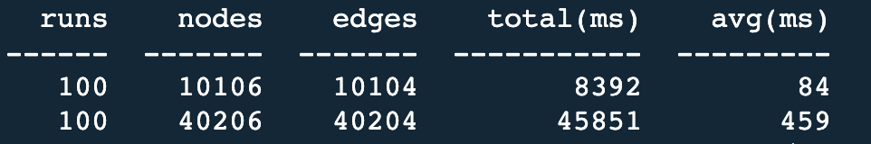

# abstract-power-supply-system-dag

[](http://commitizen.github.io/cz-cli/)

[Documentation](https://xiechao06.github.io/abstract-power-supply-system-dag/apssdag.html)

供电系统抽象图，是供电系统分析的核心数据结构, 在给定真值表下， 该图将生成以各个电源为根节点的一组树。

注意，在生成森林的过程中，只有一条规则:

```text
任意两个电源，以及电源和电源自己，不能存在闭合通路
```

而**Dc/Dc**, **闭合开关**， **正向二极管**都认为是闭合通路的一部分。

在[test_graph.py](./tests/test_graph.py)下有若干对闭合通路的测试，可以查看单元测试进一步的了解如何
是一个合法的供电系统工作状态.

## Sample

[sample](./sample.py)

## Limitations

- DAG的根一定是电源
- 电源一定接开关
- 开关接汇流条, DC/DC 或者负载
- 汇流条下有 DC/DC 或者其他开关

## Development & Test

Install [rye](https://rye-up.com/guide/installation/), then:

```bash
rye sync
pytest
```

## Benchmarks

- Generate forest



- Find passages


